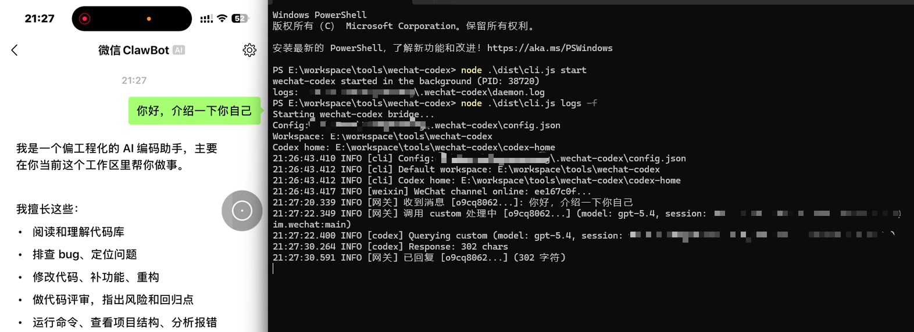
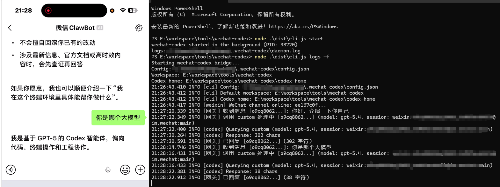
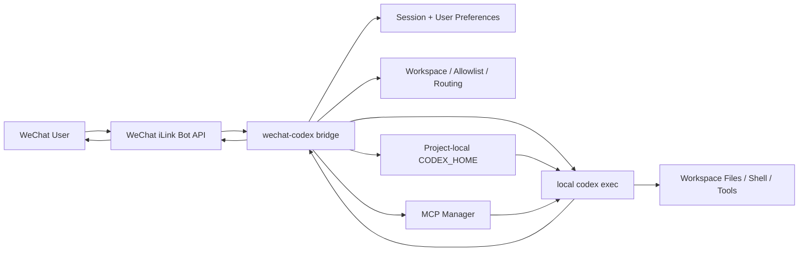

[English](./README.en.md) | [简体中文](./README.md)

# wechat-codex

Bridge WeChat messages to a local `Codex CLI` workflow so you can drive your machine from WeChat.

The message entry point uses the official WeChat iLink Bot API. Task execution is done by local `codex`, not by a remote chat-only proxy.

Reference project:

- [anxiong2025/wechat-ai](https://github.com/anxiong2025/wechat-ai)

## Screenshots

<p align="center">
  
  
</p>

## Features

- Official path: login, polling, replies, and typing status through the WeChat iLink Bot API
- Local execution: runs real `codex exec`, so it can read and write the workspace, run commands, and use tools
- Project-local isolation: uses `./codex-home` by default instead of colliding with `~/.codex`
- Multi-provider support: provider definitions live in `codex-home/config.toml`; WeChat only switches provider/model
- Real model discovery: `/models` queries the current provider's actual `/models` endpoint
- Per-user context: one ongoing context per WeChat user, with `/fork` for thread-name switching
- Workspace control: default workspace, allowed roots, and per-user workspace switching
- MCP integration: status, tool listing, reconnect, connect by name, and disconnect by name
- Skills integration: `/skills` shows the real skills installed under this project's `codex-home`
- Media handling: images are forwarded as native image inputs; voice prefers WeChat text and falls back to transcription when needed
- Operations commands: `doctor`, foreground mode, daemon mode, and log viewing

## How it works

```text
WeChat -> iLink Bot API -> wechat-codex bridge -> local codex exec -> reply back to WeChat
```

The bridge is responsible for:

- receiving WeChat messages
- managing workspace, user preferences, and sessions
- passing the task to local `Codex CLI`
- sending the result back to WeChat

## Architecture



## Quick start

### 1. Prerequisites

- Node.js 22+
- a working `codex` command on the local machine
- a WeChat iLink Bot account that can log in
- a WeChat account that already has `ClawBot` / iLink Bot availability

Check these WeChat-side prerequisites first:

- the phone can normally scan and confirm QR logins
- `ClawBot` is visible under `Me -> Settings -> Plugins`
- WeChat is updated to a recent stable version

Important boundary:

- whether `ClawBot` appears seems to be tied to account eligibility / rollout
- we do not currently have a public official source that states a hard minimum WeChat version
- as of `2026-04-02`, in local validation, accounts without the `ClawBot` plugin entry could still fail login even on newer WeChat builds

So the safer README wording is:

- first confirm `ClawBot` visibility for the account
- update WeChat to the latest stable version available on the device

Check that `codex` is available:

```powershell
codex --version
```

### 2. Install dependencies

```powershell
git clone https://github.com/HuangHaohang/wechat-codex.git
cd wechat-codex
npm install
npm run build
```

### 3. Configure project-local Codex

Edit the project-local config with your preferred editor:

```powershell
notepad .\codex-home\config.toml
```

Equivalent examples:

- Windows: `notepad .\codex-home\config.toml`
- macOS: `open -e ./codex-home/config.toml` or `nano ./codex-home/config.toml`
- Linux: `nano ./codex-home/config.toml`

The tracked template defaults to `openai`. If you want to use a custom OpenAI-compatible gateway, update it like this:

```toml
model_provider = "custom"
model = "gpt-5.4"
model_reasoning_effort = "high"
personality = "pragmatic"

[model_providers.custom]
name = "Custom"
base_url = "https://your-openai-compatible-gateway.example/v1"
env_key = "YOUR_CUSTOM_API_KEY"
wire_api = "responses"
```

Do not commit API keys into the repo. Use environment variables.

### 4. Initialize workspace and log in

```powershell
node dist/cli.js set-workspace <path-to-your-workspace>
node dist/cli.js add-root <path-to-an-allowed-root>
node dist/cli.js allow-user <wechat_user_id>
node dist/cli.js login
```

The first login shows a QR code in the terminal. Scan it and confirm on your phone. Login state is stored under the local user data directory.

How to get `wechat_user_id`:

1. leave the allowlist empty at first
2. let the target WeChat user send any message to the bot
3. ask that user to send `/whoami`
4. the bot replies with the real user id it sees
5. then the operator runs:

```powershell
node dist/cli.js allow-user <that_user_id>
```

If you lock the allowlist before the user can query `/whoami`, the user cannot discover the id. In that case, the operator needs to temporarily clear the allowlist in `~/.wechat-codex/config.json` or switch back to open mode first.

### 5. Start the bridge

```powershell
node dist/cli.js doctor
node dist/cli.js
```

To run it in the background:

```powershell
node dist/cli.js start
node dist/cli.js status
node dist/cli.js logs -f
```

## WeChat commands

### Session and workspace

- `/status`
- `/whoami`
- `/roots`
- `/workspace`
- `/workspace <path>`
- `/workspace default`
- `/new`
- `/reset`
- `/fork [name]`

### Model and execution preferences

- `/models`
- `/model`
- `/model <provider>`
- `/model <provider:model>`
- `/model <model-id>`
- `/model default`
- `/reasoning`
- `/reasoning minimal|low|medium|high|xhigh|default`
- `/personality`
- `/personality none|friendly|pragmatic|default`
- `/plan`
- `/plan on|off|default`
- `/search`
- `/search on|off|default`

### Tools / MCP / Skills

- `/mcp`
- `/mcp status`
- `/mcp tools`
- `/mcp reload`
- `/mcp connect <name>`
- `/mcp disconnect <name>`
- `/skills`
- `/skill`
- `/skill <name>|off`
- `/review [instructions]`

### Other

- `/draw <prompt>`
- `/help`

## CLI commands

```powershell
node dist/cli.js
node dist/cli.js serve
node dist/cli.js start
node dist/cli.js stop
node dist/cli.js status
node dist/cli.js logs [-f]
node dist/cli.js doctor
node dist/cli.js config
node dist/cli.js list-providers
node dist/cli.js set <provider> <key>
node dist/cli.js set-url <provider> <url>
node dist/cli.js unset <provider>
node dist/cli.js set-workspace <path>
node dist/cli.js add-root <path>
node dist/cli.js list-roots
node dist/cli.js allow-user <user_id>
node dist/cli.js deny-user <user_id>
node dist/cli.js list-users
node dist/cli.js login
node dist/cli.js logout
```

## Config files

### 1. Bridge config

Path:

```text
~/.wechat-codex/config.json
```

This means "inside the current user's home directory".

Common concrete paths:

- Windows: `C:\Users\<your-user>\.wechat-codex\config.json`
- macOS: `~/.wechat-codex/config.json`
- Linux: `~/.wechat-codex/config.json`

This stores bridge-specific runtime configuration such as:

- default workspace
- allowed roots
- WeChat channel config
- MCP server config
- user allowlist
- per-user workspace / provider / model / thread / skill preferences

### 2. Codex CLI config

Path:

```text
./codex-home/config.toml
```

This stores the project-local Codex template, including:

- default provider
- default model
- `model_providers.<id>` definitions

`wechat-codex` passes this project-local `codex-home` as `CODEX_HOME` to the local `codex` subprocess.

## MCP and Skills

### MCP

- MCP server configuration currently lives in `~/.wechat-codex/config.json`
- use `/mcp` to inspect connection status from WeChat
- `/mcp tools` lists the real tools exposed by currently connected servers

### Skills

- `/skills` reads the real skills currently present under this project's `codex-home`
- users can ask Codex in natural language to install a skill
- after installation, `/skills` will show it
- this is not a fake static list

## FAQ / Troubleshooting

### 1. QR scan succeeds but login still fails

Check these first:

- WeChat is updated to the latest stable version available on the device
- `ClawBot` is visible under `Me -> Settings -> Plugins`
- the current network can reach `https://ilinkai.weixin.qq.com`
- `node dist/cli.js doctor` shows whether saved login state already exists

If the terminal shows `fetch failed` or TLS handshake failures, that usually points to network reachability rather than bridge business logic.

### 2. `/models` says `real model discovery failed`

That means the real `/models` probe for the current provider failed. Common causes:

- wrong provider base URL
- the provider does not implement `/models`
- invalid API key
- the current network cannot reach the provider

Check:

- `codex-home/config.toml`
- the matching environment variable
- `node dist/cli.js list-providers`
- `node dist/cli.js doctor`

### 3. How do I get `wechat_user_id`?

Do not lock the allowlist first.

Recommended flow:

1. keep the allowlist empty
2. let the target user send any message to the bot
3. ask that user to send `/whoami`
4. the bot replies with the user id it sees
5. the operator runs `node dist/cli.js allow-user <that_user_id>`

### 4. A newly installed skill does not show up in `/skills`

Check that:

- the skill was installed into this project's `codex-home`
- it was not installed into global `~/.codex`
- if needed, run `/new` or restart the bridge, then try `/skills` again

### 5. `/mcp tools` is empty

This usually means no MCP server is currently connected.

Check:

- `mcpServers` in `~/.wechat-codex/config.json`
- `/mcp`
- `/mcp reload`

### 6. Voice handling is unreliable

Current behavior is:

- prefer WeChat-provided voice text when available
- only fall back to OpenAI-compatible transcription when text is missing

So voice issues are usually caused by:

- upstream WeChat did not provide text
- no working transcription endpoint is configured
- invalid API key
- unsupported media format

### 7. Can macOS / Linux run it?

From the code side, yes:

- user data lives under `~/.wechat-codex`
- the project-local `codex-home` path logic has been fixed for cross-platform path handling

But the most complete end-to-end validation so far has still been on Windows, so on macOS / Linux you should run `doctor` and validate the login flow on a real machine.

## Known limitations

- `/models` has no static fallback; if the provider's real `/models` is unavailable, the command fails directly
- WeChat login depends on the account actually having `ClawBot` / iLink Bot eligibility
- the README only says "update WeChat to the latest stable version" because we do not currently have a publicly citable official minimum-version document
- `/plan` is a bridge-level planning prompt, not the full native Codex UI planning surface
- `/fork` is a bridge-level thread-name switch, not the full native Codex UI thread-fork experience
- MCP server configuration currently lives in `~/.wechat-codex/config.json`, not in project-local `codex-home`
- Windows has the strongest validation coverage so far; macOS / Linux have the code-path fixes but still need more full-machine validation

## Security notes

- this bridge lets WeChat messages drive local Codex execution, so authorized users can effectively request operations inside the local workspace
- for any real deployment, enable the allowlist instead of leaving the bot open to everyone
- `allowedWorkspaceRoots` is the first boundary; keep it limited to directories you are willing to expose
- never commit provider secrets into the repo; use environment variables
- only template files under `codex-home` should be committed; do not commit auth, history, sessions, sqlite, logs, or other runtime state
- the current `CodexProvider` runs with `workspace-write` and `approval never` by default, which is a high-trust default and should be treated as such
- once MCP servers are connected, they expand the tool surface available to the session; verify command sources, permissions, and secret handling before enabling them

## Contact

If you run into problems, you can add me on WeChat:

<p align="center">
  
</p>

## Open-source and runtime state

The repo tracks only the safe template files under `codex-home`:

- `codex-home/config.toml`
- `codex-home/README.md`
- `codex-home/.gitignore`

The following runtime state stays untracked:

- auth
- history
- sessions
- sqlite state
- logs
- temp files
- locally installed skills

## Current boundaries

- `/models` depends on the current provider exposing a real `/models` endpoint
- voice transcription depends on a working OpenAI-compatible transcription endpoint
- GitHub does not provide a built-in language switcher here; this repo uses the README links at the top for English and Chinese switching
- the workspace-root path check has now been fixed to be cross-platform, so from the code side Windows, macOS, and Linux can all run this project
- successful WeChat login still depends on the account actually having `ClawBot` / iLink Bot eligibility
