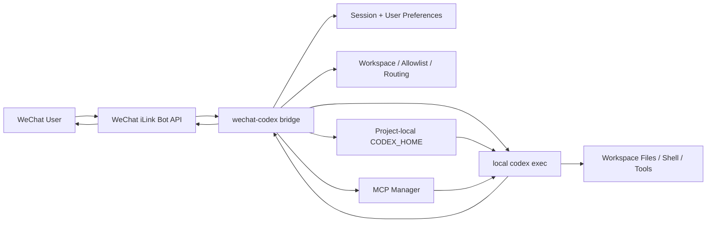

[English](./README.en.md) | 简体中文

# wechat-codex

把微信消息桥接到本地 `Codex CLI`，让你直接在微信里驱动本机工作区执行任务。

项目基于微信官方 iLink Bot API，消息入口合规；模型执行走本地 `codex`，不是纯远程聊天转发。

参考项目：

- [anxiong2025/wechat-ai](https://github.com/anxiong2025/wechat-ai)

## 产品截图

<p align="center">
  
  
</p>

## 特性

- 官方链路：使用微信官方 iLink Bot API 登录、轮询、回复和输入中状态
- 本地执行：实际调用 `codex exec`，可以读写当前工作区、运行命令、调用工具
- 项目级隔离：默认使用仓库内的 `./codex-home`，避免和 `~/.codex` 冲突
- 多 provider：`Codex CLI` 的 provider 定义写在 `codex-home/config.toml`，微信里只切 provider/model
- 真实模型发现：`/models` 查询当前 provider 的真实 `/models`，不返回伪造列表
- 多会话隔离：按微信用户维持上下文，并支持 `/fork` 切换线程名
- 工作区控制：支持默认工作区、允许根目录、按用户切换工作区
- MCP 集成：支持查看状态、列出工具、重连、按名称连接和断开 MCP server
- Skills 集成：`/skills` 显示当前项目 `codex-home` 下真实已安装的 skills
- 媒体能力：图片会作为原生图像输入传给 Codex；语音优先使用微信文本，必要时走转写
- 运维命令：支持 `doctor`、前台运行、daemon 模式、日志查看

## 工作方式

```text
WeChat -> iLink Bot API -> wechat-codex bridge -> local codex exec -> reply back to WeChat
```

这层桥接只负责：

- 接收微信消息
- 管理工作区、用户偏好和会话
- 把任务交给本地 `Codex CLI`
- 把结果回复回微信

## 架构图



## 快速开始

### 1. 前置要求

- Node.js 22+
- 本机可用的 `codex` 命令
- 一个可登录的微信 iLink Bot
- 当前微信账号已经具备 `ClawBot` / iLink Bot 可用资格

微信侧建议先确认这些条件：

- 手机微信里能正常扫码登录网页/桌面二维码
- `我 -> 设置 -> 插件` 下能看到 `ClawBot`
- 微信版本足够新

这里要说明准确边界：

- `ClawBot` 是否出现，看起来和账号资格灰度直接相关
- 我们目前没有拿到一份可公开引用的官方“最低微信版本”文档
- 截至 `2026-04-02` 的本地排查里，账号即使在较新的微信版本上，如果没有 `ClawBot` 插件入口，也可能无法完成登录

所以 README 更适合写成：

- 必须先确认账号具备 `ClawBot` 可见性
- 微信版本请先升级到你设备上的最新稳定版

先确认 `codex` 已安装：

```powershell
codex --version
```

### 2. 安装依赖

```powershell
git clone https://github.com/HuangHaohang/wechat-codex.git
cd wechat-codex
npm install
npm run build
```

### 3. 配置项目内 Codex

编辑项目内配置文件。不同系统请用你自己的编辑器：

```powershell
notepad .\codex-home\config.toml
```

等价示例：

- Windows: `notepad .\codex-home\config.toml`
- macOS: `open -e ./codex-home/config.toml` 或 `nano ./codex-home/config.toml`
- Linux: `nano ./codex-home/config.toml`

默认模板使用 `openai`。如果你要接自定义 OpenAI-compatible 网关，可按下面方式修改：

```toml
model_provider = "custom"
model = "gpt-5.4"
model_reasoning_effort = "high"
personality = "pragmatic"

[model_providers.custom]
name = "Custom"
base_url = "https://your-openai-compatible-gateway.example/v1"
env_key = "YOUR_CUSTOM_API_KEY"
wire_api = "responses"
```

不要把 API key 写进仓库文件。请使用环境变量。

### 4. 初始化工作区与登录

```powershell
node dist/cli.js set-workspace <path-to-your-workspace>
node dist/cli.js add-root <path-to-an-allowed-root>
node dist/cli.js allow-user <wechat_user_id>
node dist/cli.js login
```

首次登录会在终端里显示二维码。扫码并在手机上确认后，登录态会保存到本机用户目录。

`wechat_user_id` 的获取方式：

1. 启动时先不要配置 allowlist，保持默认空列表
2. 让目标微信用户先给机器人发一条消息
3. 用户发送 `/whoami`
4. 机器人会返回它看到的真实 `user id`
5. 再由运维执行：

```powershell
node dist/cli.js allow-user <that_user_id>
```

如果你一开始就把 allowlist 锁死了，用户拿不到 id，这时只能由运维手动清理 `~/.wechat-codex/config.json` 里的 allowlist，或者先换成开放模式再重新获取。

### 5. 启动桥接

```powershell
node dist/cli.js doctor
node dist/cli.js
```

如果要后台运行：

```powershell
node dist/cli.js start
node dist/cli.js status
node dist/cli.js logs -f
```

## 微信内命令

### 会话与工作区

- `/status`
- `/whoami`
- `/roots`
- `/workspace`
- `/workspace <path>`
- `/workspace default`
- `/new`
- `/reset`
- `/fork [name]`

### 模型与执行偏好

- `/models`
- `/model`
- `/model <provider>`
- `/model <provider:model>`
- `/model <model-id>`
- `/model default`
- `/reasoning`
- `/reasoning minimal|low|medium|high|xhigh|default`
- `/personality`
- `/personality none|friendly|pragmatic|default`
- `/sandbox`
- `/sandbox read-only|workspace-write|danger-full-access|default`
- `/approval`
- `/approval never|on-request|default`
- `/approve [workspace-write|danger-full-access]`
- `/deny`
- `/plan`
- `/plan on|off|default`
- `/search`
- `/search on|off|default`

### Tools / MCP / Skills

- `/mcp`
- `/mcp status`
- `/mcp tools`
- `/mcp reload`
- `/mcp connect <name>`
- `/mcp disconnect <name>`
- `/skills`
- `/skill`
- `/skill <name>|off`
- `/review [instructions]`

### 其他

- `/draw <prompt>`
- `/help`

## CLI 命令

```powershell
node dist/cli.js
node dist/cli.js serve
node dist/cli.js start
node dist/cli.js stop
node dist/cli.js status
node dist/cli.js logs [-f]
node dist/cli.js doctor
node dist/cli.js config
node dist/cli.js list-providers
node dist/cli.js set <provider> <key>
node dist/cli.js set-url <provider> <url>
node dist/cli.js unset <provider>
node dist/cli.js set-workspace <path>
node dist/cli.js add-root <path>
node dist/cli.js list-roots
node dist/cli.js allow-user <user_id>
node dist/cli.js deny-user <user_id>
node dist/cli.js list-users
node dist/cli.js login
node dist/cli.js logout
```

## 配置文件

### 1. 桥接配置

路径：

```text
~/.wechat-codex/config.json
```

这表示“当前用户 home 目录下的 `.wechat-codex`”。

常见实际路径：

- Windows: `C:\Users\<your-user>\.wechat-codex\config.json`
- macOS: `~/.wechat-codex/config.json`
- Linux: `~/.wechat-codex/config.json`

这里保存桥接自己的运行配置，例如：

- 默认工作区
- 允许的根目录
- 微信 channel 配置
- MCP server 配置
- 用户 allowlist
- 每个微信用户的 workspace / provider / model / thread / skill 偏好

### 2. Codex CLI 配置

路径：

```text
./codex-home/config.toml
```

这里保存项目内的 Codex 配置模板，包括：

- 默认 provider
- 默认 model
- `model_providers.<id>` 定义

`wechat-codex` 会把项目内 `codex-home` 作为 `CODEX_HOME` 传给本地 `codex` 子进程。

## MCP 与 Skills

### MCP

- MCP server 的配置目前保存在桥接配置 `~/.wechat-codex/config.json`
- 微信里可用 `/mcp` 查看连接状态
- `/mcp tools` 会列出当前已连接 server 暴露出来的真实工具

### Skills

- `/skills` 读取的是当前项目 `codex-home` 下真实存在的 skills
- 用户可以通过自然语言让 Codex 安装 skill
- 安装完成后，再发 `/skills` 就能看到
- 这部分不是伪造列表，也不是写死在 README 里的预设项

## FAQ / Troubleshooting

### 1. 扫码后还是登不上

优先检查这几项：

- 微信已经升级到当前设备可用的最新稳定版
- `我 -> 设置 -> 插件` 里能看到 `ClawBot`
- 当前网络能访问 `https://ilinkai.weixin.qq.com`
- 终端里运行 `node dist/cli.js doctor` 看是否已有保存的登录态

如果终端报 `fetch failed` 或 TLS 握手失败，这通常不是业务逻辑错误，而是当前网络到微信接口不通。

### 2. `/models` 提示 `real model discovery failed`

这表示当前 provider 的真实 `/models` 探测失败。常见原因：

- provider base URL 写错
- provider 不支持 `/models`
- API key 无效
- 当前网络无法访问 provider

先检查：

- `codex-home/config.toml`
- 对应环境变量是否存在
- `node dist/cli.js list-providers`
- `node dist/cli.js doctor`

### 3. `wechat_user_id` 不知道怎么拿

不要一开始就锁 allowlist。

推荐流程：

1. 保持 allowlist 为空
2. 让目标用户先给机器人发消息
3. 让目标用户发送 `/whoami`
4. 机器人返回 user id
5. 运维再执行 `node dist/cli.js allow-user <that_user_id>`

### 4. `/skills` 里看不到新装的 skill

先确认：

- 这个 skill 确实安装到了当前项目的 `codex-home`
- 不是装到了你全局的 `~/.codex`
- 如有需要，执行 `/new` 或重启 bridge 后再试一次 `/skills`

### 5. `/mcp tools` 是空的

这通常不是命令坏了，而是当前没有已连接的 MCP server。

先检查：

- `~/.wechat-codex/config.json` 里的 `mcpServers`
- `/mcp`
- `/mcp reload`

### 6. 语音不好用

当前逻辑是：

- 优先使用微信已经给出的语音文本
- 没有文本时，才尝试走 OpenAI-compatible 转写接口

所以语音失败通常是：

- 微信上游没有给文本
- 没配置可用的转写接口
- API key 无效
- 媒体格式不受支持

### 7. macOS / Linux 能不能用

从代码层面可以：

- 用户数据目录用的是 `~/.wechat-codex`
- 项目内 `codex-home` 路径逻辑已经做了跨平台修正

但当前仓库主要在 Windows 环境下做过完整联调，macOS / Linux 更适合先按 README 跑一轮 `doctor` 和登录验证。

## 已知限制

- `/models` 不做静态回退，当前 provider 的真实 `/models` 不通就直接失败
- 微信登录能力依赖账号本身是否具备 `ClawBot` / iLink Bot 资格
- README 中关于微信版本只写“升级到最新稳定版”，因为目前没有可公开引用的官方最低版本文档
- `/plan` 是桥接层的计划模式提示，不是 Codex 原生 UI 的完整计划面板
- `/fork` 是桥接层线程名切换，不是 Codex 原生 UI 的完整线程分叉界面
- MCP server 配置目前保存在 `~/.wechat-codex/config.json`，不是项目内 `codex-home`
- 当前主要验证过 Windows；macOS / Linux 已按代码修正跨平台路径逻辑，但仍缺少完整实机验证

## 安全说明

- 这是一个“让微信消息驱动本地 Codex 执行”的桥接器，授权用户本质上可以要求本机代理执行工作区内操作
- 生产或长期运行时，强烈建议启用 allowlist，不要长期保持开放模式
- `allowedWorkspaceRoots` 是第一层边界，务必只加入你愿意暴露给机器人的目录
- provider 密钥不要写进仓库，应该使用环境变量
- 项目内 `codex-home` 只应提交模板文件，不要提交 auth、history、sessions、sqlite、logs 等运行态文件
- 当前 `CodexProvider` 默认是 `read-only` 加 `approval never`
- 如果要放权，需要在微信里显式发送 `/sandbox workspace-write` 或 `/sandbox danger-full-access`
- MCP server 一旦接入，就相当于把额外工具能力暴露给会话；接入前应确认命令来源、权限边界和密钥管理

## 联系方式

有问题可以直接加我微信：

<p align="center">
  
</p>

## 开源与运行态文件

仓库跟踪的是安全模板：

- `codex-home/config.toml`
- `codex-home/README.md`
- `codex-home/.gitignore`

不会提交的运行态内容包括：

- auth
- history
- sessions
- sqlite state
- logs
- 临时文件
- 安装后的本地 skills

## 当前边界

- `/models` 依赖当前 provider 真正支持 `/models`
- 语音转写依赖可用的 OpenAI-compatible 转写接口
- GitHub 没有内建语言切换器，这个仓库通过 README 顶部链接在中英文之间切换
- 代码现在已经修正了工作区路径判断的跨平台问题；从代码层面看，Windows、macOS、Linux 都可以安装运行
- 但微信登录前提是否满足，仍取决于账号本身是否具备 `ClawBot` / iLink Bot 资格
